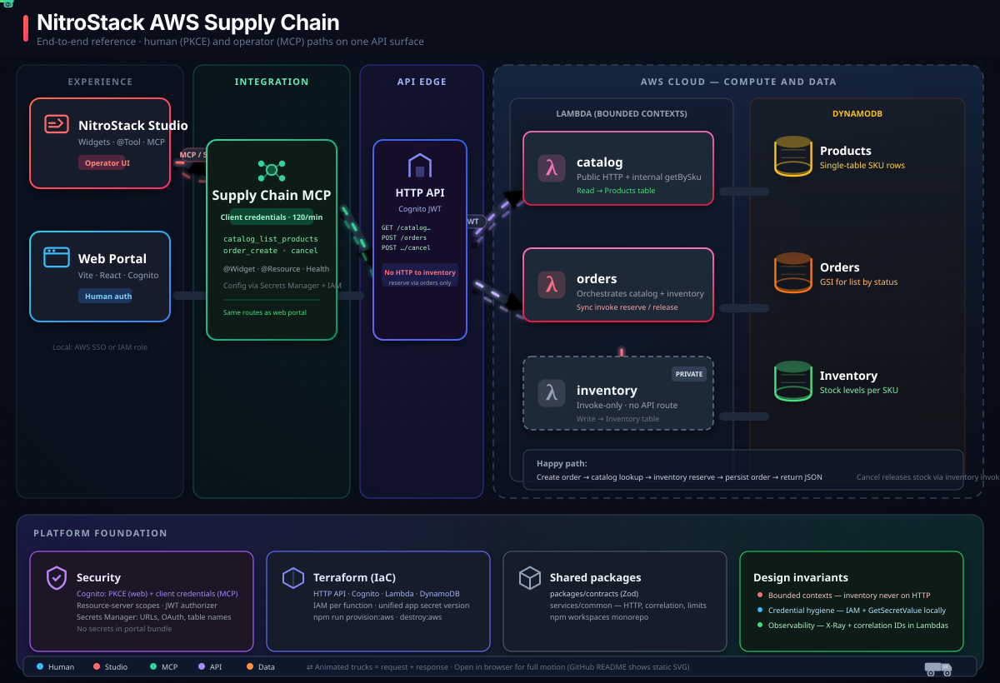

# Supply Chain MCP — NitroStack, AWS & Terraform

A standalone [Model Context Protocol (MCP)](https://modelcontextprotocol.io/) reference for **supply chain and order fulfilment** on AWS: product catalog, stock reservation, and order orchestration behind a single **HTTP API** with **Cognito** authentication. It demonstrates an **end-to-end** path: **[NitroStack Studio](https://nitrostack.ai/)** (tools + widgets) → **API Gateway (HTTP API)** → **Lambda** (bounded contexts) → **DynamoDB**, with **Terraform** as the source of truth for infrastructure and **Secrets Manager** for runtime configuration—**no mock APIs** in the happy path.

---

## Table of contents

- [Significance](#significance)
- [Business benefits & pain points](#business-benefits--pain-points)
- [Target audience](#target-audience)
- [Solution architecture](#solution-architecture)
- [Tool stack](#tool-stack)
- [AWS deployment, security & operations](#aws-deployment-security--operations)
- [Prerequisites](#prerequisites)
- [Setup & run](#setup--run)
- [Deployment](#deployment)
- [AWS cost notice (PoC)](#aws-cost-notice-poc)
- [Rollback / teardown](#rollback--teardown)
- [Observability (CloudWatch & correlation IDs)](#observability-cloudwatch--correlation-ids)
- [Tools reference](#tools-reference)
- [Layout](#layout)
- [References](#references)
- [License](#license)
- [Contributing](#contributing)
- [Conclusion](#conclusion)

---

## Significance

**Executive summary.** Organizations modernizing B2B or internal supply workflows often struggle to connect **AI assistants and operations tools** to the same APIs and policies their web and mobile apps use. This module shows how **NitroStack** can front a real AWS stack so that **Studio**, agents, and humans share one contract: **JWT-authorized HTTP APIs**, **machine-to-machine** access for automation, and **DynamoDB-backed** inventory rules—without duplicating business logic in ad hoc scripts. Terraform provisions the full footprint (API, Lambdas, tables, Cognito, Secrets Manager), while a **Vite web portal** proves the **human (PKCE)** path and the **MCP (client credentials)** path against the **same** API surface.

---

## Business benefits & pain points

**Pain points addressed**

- **Disjoint channels** — Catalog, inventory, and orders often live in separate consoles, spreadsheets, or legacy UIs; teams lack one composable surface for assistants and operators. This module consolidates access behind **one HTTP API** and an **MCP tool** surface with widgets.
- **Configuration drift** — API URLs, OAuth endpoints, and machine credentials scattered across environments. **Terraform** publishes a **unified app secret** in **Secrets Manager**; local tooling resolves configuration through **IAM** at runtime.
- **Fragile demos** — Reference apps that rely on mocks hide real failure modes. This stack uses the **live AWS path**: failures surface as structured JSON and logs for production-like debugging.

**Benefits**

- **Clear ownership** — **Bounded contexts** (`catalog`, `inventory`, `orders`) map to Lambdas and tables; orders orchestrates peers via **invoke**, inventory stays **off the public HTTP surface** for reserve/release.
- **Predictable security model** — **Cognito JWT authorizer** on API routes; **resource-server scopes** for fine-grained access; **Secrets Manager** for MCP client credentials and table metadata.
- **Repeatable environments** — `npm run provision:aws` builds Lambdas, applies Terraform, and writes generated local config from Terraform outputs.

---

## Target audience

- Teams evaluating **NitroStack** for **industry MCP servers** with **Studio widgets** and real backend integration.
- **Platform and cloud engineers** who want a **Terraform-first** AWS pattern (HTTP API + Lambda + DynamoDB + Cognito) they can fork for other domains.
- **Solution architects** comparing **human (browser PKCE)** vs **machine (client credentials)** flows against a **single** API.

---

## Solution architecture



The diagram lives at [`docs/architecture.svg`](./docs/architecture.svg). Open that file in a browser or VS Code after pull for animated flows. Inventory is **invoke-only** (no API Gateway route).

| HTTP route (JWT) | Lambda | Notes |
|------------------|--------|--------|
| `GET /v1/catalog/products` | catalog | List products (scan, limit 100) |
| `GET /v1/catalog/products/{productId}` | catalog | Single product (SKU-validated) |
| `POST /v1/orders` | orders | Create order — catalog lookup + inventory reserve per line |
| `GET /v1/orders` | orders | List orders via **GSI1** |
| `GET /v1/orders/{orderId}` | orders | Get one order |
| `POST /v1/orders/{orderId}/cancel` | orders | Cancel **CONFIRMED** order and release stock |

**Operator path:** Studio → **NitroStack MCP** (`supply_chain` tool, Cognito **client credentials**) → **API Gateway** → **catalog** or **orders** → **DynamoDB**. Orders **invokes** catalog (`getBySku`) and inventory (`reserve` / `release`).

**Human path:** **web-portal** → **OIDC + PKCE** → same API routes with a **user** access token.

**Provision path:** `npm run provision:aws` → Lambda build → **Terraform apply** → optional **`npm run seed`**.

---

## Tool stack

| Layer | Technology |
|--------|------------|
| MCP / DI / decorators | [NitroStack](https://nitrostack.ai/) (`@nitrostack/core`, CLI) |
| Studio UI | Next.js widgets, `@nitrostack/widgets` |
| HTTP API | **Amazon API Gateway HTTP API** + **JWT authorizer** (Cognito) |
| Auth | **Amazon Cognito** — web (PKCE), MCP (client credentials), **resource server** scopes |
| Compute | **AWS Lambda** (Node.js 20), **X-Ray** tracing |
| Data | **Amazon DynamoDB** (products, inventory, orders + GSI) |
| Secrets / config | **AWS Secrets Manager** (JSON from Terraform) |
| IaC | **Terraform** ≥ 1.5 |
| Browser app | **Vite** + React, **oidc-client-ts** |
| Validation | **Zod** (`packages/contracts`); shared **`services/common/`** (HTTP, correlation IDs, limits) |
| Monorepo | **npm workspaces** — contracts, Lambdas, MCP, web-portal |

---

## AWS deployment, security & operations

| Topic | How this repo handles it |
|--------|---------------------------|
| **Least privilege (runtime)** | Per-Lambda IAM: catalog reads **products**; inventory mutates **inventory** only; orders reads/writes **orders** + GSI and **invokes** catalog/inventory. |
| **Secrets** | MCP credentials and service URLs in **Secrets Manager**, not in source control. |
| **State** | Terraform state is **gitignored**; use a **remote, encrypted backend** for teams ([infrastructure/terraform/README.md](./infrastructure/terraform/README.md)). |
| **Operator IAM** | Post-deploy policy available via `terraform output -raw nitrostack_mcp_operator_policy_json`. |
| **Region defaults** | **`us-east-2`** in examples; override with `AWS_REGION` / `-var=aws_region=...`. |

See [SECURITY.md](./SECURITY.md) for credential handling and reporting.

---

## Prerequisites

- **Node.js** 20+
- **Terraform** ≥ 1.5 and **AWS CLI**
- **AWS account** with IAM permissions to deploy the stack
- **Optional:** [NitroStack Studio](https://nitrostack.ai/studio) for interactive MCP and widget testing

---

## Setup & run

```bash
cd module-repos/aws/supply-chain
npm install
```

Configure AWS credentials for your shell (for example **AWS SSO** or the default credential chain). See [docs/DEPLOY_AND_DEVELOP.md](./docs/DEPLOY_AND_DEVELOP.md) for environment details.

**Provision infrastructure (recommended)**

```bash
export AWS_REGION=us-east-2
export TF_AUTO_APPROVE=1    # omit for interactive terraform apply
export RUN_SEED=1           # optional: seed DynamoDB after apply
npm run provision:aws
```

**MCP development**

```bash
npm run dev
```

Attach [NitroStack Studio](https://nitrostack.ai/studio) to the **`mcp-server`** directory.

**Production build**

```bash
npm run build
```

**Web portal**

```bash
cd web-portal && npm install && npm run dev
```

**Seed data (after deploy)**

```bash
npm run seed
```

---

## Deployment

1. **Install:** `npm install`
2. **Build:** `npm run build`
3. **Provision:** `npm run provision:aws` (or Terraform under `infrastructure/terraform/`)
4. **Operator IAM:** attach `nitrostack_mcp_operator_policy_json` if required for local MCP/seed
5. **Seed:** `npm run seed` unless `RUN_SEED=1` was set during provision
6. **Validate:** Studio → `mcp-server/` widget; **web-portal** for browser OIDC

The documented production path is **Terraform only**. A local SAM archive may exist under **`backup/`** (gitignored).

---

## AWS cost notice (PoC)

> **Caution:** This module deploys **real AWS resources** in your account. You **will incur charges** while the stack is running. Costs depend on region, traffic, and how long resources stay up. Figures below are **approximate** for light PoC / dev use in **`us-east-2`** — not a quote. Use the [AWS Pricing Calculator](https://calculator.aws/) and [Cost Explorer](https://console.aws.amazon.com/cost-management/home) for your account.

| Service | What this stack creates | Typical PoC cost (order of magnitude) |
|---------|-------------------------|----------------------------------------|
| **DynamoDB** | 3 on-demand tables (products, inventory, orders) | **~$0–5/mo** idle with seed data; scales with reads/writes |
| **Lambda** | 3 functions (catalog, inventory, orders), X-Ray on | **~$0–10/mo** light testing (often within free tier) |
| **API Gateway** | HTTP API + JWT routes | **~$0–3/mo** for thousands of requests |
| **Cognito** | User pool, domain, 2 app clients, resource server | **~$0–5/mo** for a handful of test users |
| **Secrets Manager** | 1 app secret (JSON config) | **~$0.40–1/mo** per secret + API calls |
| **CloudWatch Logs** | Lambda log groups | **~$1–5/mo** with moderate dev traffic |

**Rough total:** about **$5–25 USD per month** if you leave the stack running with occasional Studio/API testing; **$15–50+** with heavier load or 24/7 traffic. Destroying the stack (see [Rollback](#rollback--teardown)) stops **new** usage-based charges; you still pay for usage already metered in the current billing period.

---

## Rollback / teardown

Use this when a PoC is finished, you need to reset the environment, or you want to avoid ongoing AWS charges.

**Recommended (from `supply-chain/`):**

```bash
export AWS_REGION=us-east-2
export TF_AUTO_APPROVE=1   # required for non-interactive destroy; omit to type 'destroy' at prompt
npm run destroy:aws
```

This runs [`scripts/destroy-terraform-stack.sh`](./scripts/destroy-terraform-stack.sh), which executes **`terraform destroy`** and removes **`.generated/.env`** (`CLEAN_LOCAL=1`).

**Manual equivalent:**

```bash
cd infrastructure/terraform
terraform init
terraform destroy -var="aws_region=us-east-2"
cd ../..
rm -f .generated/.env
```

**After destroy**

- Confirm in the AWS Console (correct region) that Lambdas, API, tables, Cognito pool, and the app secret are gone.
- Local **MCP / web-portal** calls will fail until you run **`npm run provision:aws`** again.
- **Terraform state** (local or remote) should reflect an empty stack; do not commit `terraform.tfstate`.
- **Cognito hosted UI domain** and some resources can take a few minutes to fully disappear after destroy completes.

**What destroy does not remove**

- IAM policies attached outside Terraform, manual console changes, or resources created in other regions.
- Historical rows in **AWS billing** — check Cost Explorer for the billing period.

---

## Observability (CloudWatch & correlation IDs)

| Mechanism | Role |
|-----------|------|
| **Amazon CloudWatch Logs** | Lambda structured JSON log lines |
| **`x-correlation-id`** | Propagated on API responses and MCP HTTP calls |
| **AWS X-Ray** | Enabled on Lambdas in Terraform |
| **MCP health checks** | `@HealthCheck` for process and **STS** connectivity |

---

## Tools reference

| Surface | Description |
|---------|-------------|
| **`supply_chain` MCP tool** | Actions: `catalog_list`, `catalog_get`, `order_create`, `order_list`, `order_get`, `order_cancel`, `get_public_config`. **`@RateLimit`** (120/min). |
| **`@Resource`** | `supply-chain://bounded-contexts` — architecture and sequence |
| **`@Prompt`** | Supply-chain prompts for Studio |
| **Widgets** | **Supply chain studio** — `@Widget('supply-chain-studio')` |
| **`@HealthCheck`** | Process and AWS connectivity (`mcp-server/src/health/`) |

---

## Layout

```text
supply-chain/
  packages/contracts/       # Zod schemas + observability helpers
  services/common/          # Shared Lambda HTTP utilities
  services/catalog|inventory|orders/
  mcp-server/               # NitroStack MCP + widgets
  web-portal/               # Vite + React OIDC client
  infrastructure/terraform/ # Production IaC
  scripts/                  # provision, destroy, seed, generated env writer
  docs/                     # architecture.svg, runbooks, ARCHITECTURE.md
```

---

## References

- NitroStack: [nitrostack.ai](https://nitrostack.ai/) · [docs.nitrostack.ai](https://docs.nitrostack.ai/)
- NitroStack Studio: [nitrostack.ai/studio](https://nitrostack.ai/studio)
- Solution diagram: [docs/architecture.svg](./docs/architecture.svg)
- Architecture notes: [docs/ARCHITECTURE.md](./docs/ARCHITECTURE.md)
- Deploy guide: [docs/DEPLOY_AND_DEVELOP.md](./docs/DEPLOY_AND_DEVELOP.md)
- Deployment runbook: [docs/DEPLOYMENT_RUNBOOK.md](./docs/DEPLOYMENT_RUNBOOK.md)
- Terraform: [infrastructure/terraform/README.md](./infrastructure/terraform/README.md)

---

## License

This module follows the **license policy of the parent NitroStack / monorepo** it lives in. If this folder is extracted to a standalone repository, add a root **LICENSE** file to match your organization’s open-source policy.

---

## Contributing

Contributions are welcome. Preserve architecture boundaries: **Terraform** for AWS resources, **Lambdas** for domain logic, **NitroStack** for MCP and widgets, **Cognito + API Gateway** for auth. Use **Conventional Commits** (`feat:`, `fix:`, `docs:`, …). See [SECURITY.md](./SECURITY.md) before opening PRs.

---

## Conclusion

This repository is an **AWS reference** for **NitroStack-backed supply chain workflows**: one **HTTP API** over **Lambda** and **DynamoDB**, **Cognito** for people and machines, **Secrets Manager** for configuration, and **Terraform** for reproducible environments. The same contract serves the **browser**, the **MCP**, and future agents—with IAM boundaries, correlation IDs, and CloudWatch observability built in.

**Further reading**

- [AWS HTTP APIs](https://docs.aws.amazon.com/apigateway/latest/developerguide/http-api.html)
- [AWS Secrets Manager](https://docs.aws.amazon.com/secretsmanager/)

For a related NitroStack module, see [Automotive](../../automobile/) in this monorepo.
