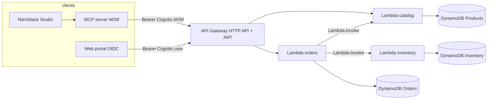

# Architecture — bounded contexts & dependencies

## Dependency order

1. **Catalog** and **inventory** tables + Lambdas (no cross-service calls).
2. **Orders** Lambda (requires env vars for catalog + inventory function names).
3. **API Gateway** routes + **Cognito** authorizer (depends on user pool + clients).
4. **Seed** catalog + inventory rows (real quantities).
5. **Secrets Manager** unified app secret (Terraform): MCP OAuth + API URLs + table names (encrypted at rest by AWS).
6. **MCP server** — `supply-chain/.env` (AWS credentials only) + `.generated/.env` (from Terraform outputs) + `nitrostack-cli dev`.
7. **Web portal** — Vite reads `supply-chain/.env` and `.generated/.env` (no separate `.env.local` required).

## NitroStack feature map

| NitroStack capability | Where it appears |
|-----------------------|------------------|
| `@Tool` + Zod | `mcp-server/src/modules/supply-chain/supply-chain.tools.ts` |
| `@Widget` + Next widget bundle | `mcp-server/src/widgets/` |
| `@Resource` | `supply-chain.resources.ts` |
| `@Prompt` | `supply-chain.prompts.ts` |
| `@RateLimit` | `supply-chain.tools.ts` |
| `@HealthCheck` | `mcp-server/src/health/*.health.ts` |
| Studio workflow | `README.md` — `nitrostack-cli dev` |

## Notes

- **Inventory** is intentionally **not** exposed on API Gateway; only **orders** may reserve/release stock, keeping the invariant enforceable in one place.
- **productId** is aligned with **sku** in seed data so internal catalog lookups stay a single `GetItem`.
